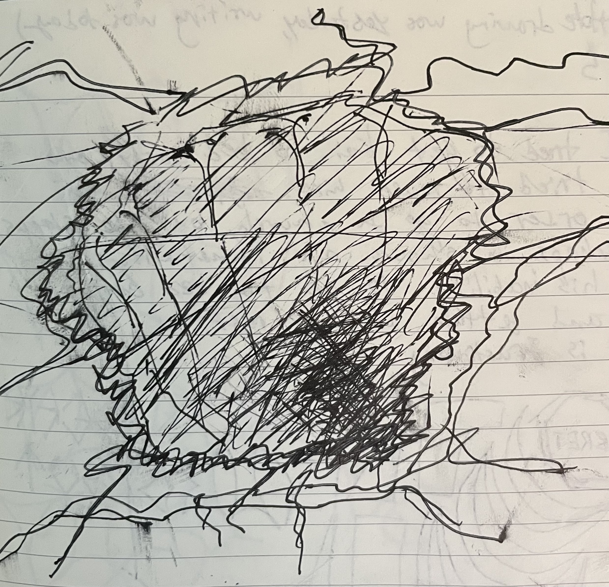

# writings

## longer

* ["The 'I' in AI"](ai.html) (2026-09-30)
* ["Capsicum"](capsicum.html) (2025-08-29)

## poems

2026-10-02

### The perpetual Regensburg Diet

```
The perpetual Regensburg Diet
Coencides with Westphalian Peace
The perpetual Regensburg Diet
Hasn't to do with something to eat

"The perpetual" Regensburg Diet
Means it's always meeting
The perpetual Regensburg Diet
Does not have to do with eating!

My perpetual Regensburg diet
Consists of Bier and Bratwurst
The perpetual Regensburg Diet
Liegt noch immer im Altes Rathaus
```

### Ranko

```
Last week I saw him walking up the stairs to the slides, then again once, then later we started talking.
He thought my smile was friendly, I gave him a bottle
He needed a cigarette, he thought
He showed me his board, and I, to him, my bike
He did wheelies until he was shunned and told me how they were illegal in Germany
He tried to teach me how to pop one
He told me how cars, since jail, are just cells.
I had to go to bed, back to my cell
He sulked about my retreat... that we can't hang out
I said, we have been hanging
I left him on the street
The next morning my neighbours were texting about a creep
Trying to break in: we need signs, and barriers.
```

### The foreign place

```
The foreign place has many faces
Someone who thinks themselves sophisticated
And all they have to deal with is cleaning an odd, inert, orange goo
The goo comes in different organic shapes along the sides of the useful grey boxes
To many, including yourself, this seems like an agreeable situation.
But the more you, yourself, clean the goo, the more its irregularities, or rather, unusualities procede forth.
Its turgid funk seaps into the hands of those who handle it, but those here who notice that are none.
Or perhaps one: you, yourself.
It becomes hard to describe without feeling reflexive criticism identifying that horrible fault: intolerance.
```

### Shit spectre

```
Looking at my foot an insane comedy is realized
It's shit
Looking at my foot while brushing my teeth
I noticed it
Do I feel anger at the other with whome I share? or embarrassement at myself?
Disgust or disgust?
These two polarities somehow strike neutrally:
While I fervently clean, I am void of anger or embarrassement.
If it was possibly mine without any way of knowing, it could be his in the same way, blamelessly.
Two other possibilities exist: those intentioned:
    He did it on purpose, in order to haunt
    A different me I do not know did it the same
To haunt him or me?
Had he ever saw it?
Did he think the same?
Did I ever see it?
My teeth are clean and so is the floor
And with that I start my day.
```

### The gunman had a mandolin

```
"I saw him!
The gunman had a mandolin
He carried a vengeful grudge
But didn't everyone?
Are you the gunman?

Haven't you a mandolin?
And haven't you, beyond the pale, between the sludge
Admitted to, and made jokes about a gun?
But didn't everyone?
```

### Modern Archaeology

```
Modern Archaeology is
Films
In warehouses
Lost only 30 years ago
Found only 60 years later
In warehouses
I misplaced my wallet yesterday
Only to find it today
```

### Necropolis

```
I was thinking about what a weird word is necropolis
And walking on the path by where that big building is
The one that's empty, with all its lights on
And I saw one person walking across its glass-open bridge
```

### Morphing

```
So there I was, making tonnato sauce
With a blender of a tall cup, like for making smoothies
And I thought about how some are repulsed by tuna, and small fish like anchovies
Then, as I was squeezing a lemon, I thought a seed dropped in
First, I reached with my fingers, which didn't work in the narrow vessel
Then I tried with a fork, but couldn't find the seed
And there I was perusing small pieces of tuna flesh, that kept morphing into the shape of a lemon seed
```

### Cobblers

```
What happened to all the cobblers's
What I hope doesn't happen to me
What happened to all the cobblers's
Because we all have plastic on our feet
```

---

2025-09-05

### Palantir

```
Palantir sees you cry
Palantir finds you a sad person
Palantir sends you a candy bar in the mail
You realize the West is the greatest civilization
```

### Berlin

```
Palette seats
Composite wood walls
Paint, of course
Around most of the corners we find some kind of bulb, or box
For the maintenance of the city or the regular doings of people
But this object is just littered
In grit
```

### Industrial

```
What is Industrial
Industrial is something interrupting ways of being
Industrial is natural, but not biological
Industrial is captured by disliked forces
But it can also be captured by the people
```

### Return to form

```
Spacecraft architechture
Internally comports
Spacecraft arkitekt
Impressively sorts
Out confounding
Rooms upon
Rooms upon
Rooms
```

### Search terms

```
How to be interdisciplinary
How to "make it" as an artist
How to drop out and remain relevant
How to relinquish desires for relevance
How to be read by others
Should every great artist practice sculpture
Do you practice sculpture

How to stomach long form media in the post-information age
How to build basic domestic structures
Can you live in self-made structures without worrying about both the IRS and relevance?
```

### Tumbling

```
Tumbling things down is a critical act
But when things are tumbled
Critique is in cohesion
```

### Easels

```
Solidify: six easels draft
Permanence: bronze figures cast
Undone: munitions needs shaft
Statues: they are now bullets 
Easels: now draft other formations
```

### From Pearl Street to the Water and back

```
Shafted and piled down on, through and without the cause, but the cause remains a question:
    how did I become sad, and, how did I forget how.
The cause, the cause...
Without the cause---a stupid way to be
But sometimes things just are, and you think I mean to say we can't change them, but of course we can;
We are all powerful but just powerful enough not to see the bus we got on at Pearl Street and rode down to the water.
And you ask how we got here---did I walk here? And I'm not sure, and say so. But yes! We can leave.
And so we walk on down the path populated by stiff and old souls, stuck together and looked-down, blameless, like us if we thought we had to stay.
We walk around the whole town with our guitars, happy enough.
```

### Balthazar

```
The Balthazar waitstaff's situating the table further from the booth for you seating convenience
My inclusion of the name's perpetuating of the myth and the status
```

### Modern comedy

```
How do you enjoy computational modules?
In many ways; by creating them (1)
I'm not sure how you do that (2)
You do it by configuring them.
That's not one of the ways I enjoy them, why prescribe (1)
Interesting, that computes (2)
I have a question for you, first entity:
    what modules have you created?
    This process should not be enjoyable.
Why do you call me "first entity"? Anyways, I have created two modules, 1 and 2, and yes I enjoyed creating them (1)
Who is the "first entity"? (2)
If you had yourself configured them, you would understand.
I can't see how understanding lies in configuration (1)
Understand what? (2)
```

### To be outside

```
What does it mean to be outside
Well most the time it's better
Revel in uncontainment, in trees
And it's even nice to be out in the rain
But in the end it's better not to be an outsider in the rain
```

### The star

```
I'd like to be the star of a lifestyle magazine
I'd like you to see me as fine
But harmful to society
But that harmful in an outlet no longer with wide reach, ineffective
And yet I'm attractive
```

### Writing like

```
Writing like what?
Writing like it's what's to do?
Writing like you like to write?
Writing like you have to

Why do you have to write, or rather
Writing like you have to, why are you?
Why are you writing like that?
Writing like that because you like to

But really having to write's not like writing like you have to, or rather
Writing like you have to's not like having to write
Since you don't have to like to write, but
Writing like that's writing how you like
```

### The latest art

```
Everything is falling out
Is there anywhere safe now?

What is the latest art?
Is it in pieces?

Are there pieces in buildings that can be called the latest art?
```

### 'A deep hole' and corresponding diagram

```
A deep hole is an emotional expression
---Desolation---
You could focus on the symbology of the void:
    something missing
Or plain emptiness without previous or aspiring existence
The labor in creating the hole (if it is to have been created) could also be focused on:
    Monotony, dread, exertion in digging;
The laborer may use the hole as an outlet for anger, or coherence in depression
```



### Assembly's Appeal

```
Why is assembly appealing
Why is appeal assembling
I want appeal to assemble
Do I want assembly to appeal?
Not necessarily; assembly's appeal merely emerges
Thus, appeal assembles through the emergence of assembly's appeal
```

### PSA from MLG

```
Public Service Announcement from the Modernist Landed Gentry, owners of Homeowners Associations and the like:
Dance music is corrupting our youth, luring them to radical night time events where they do nothing but experience, regret their jobs, and spend money on fuel.
If we just get them awake more during the day, maybe, they'll do more listening, appreciating, and buying of property.
```

### 'Some plans' and 'Some problem'

```
Some plans
Indicate construction
Others construe
         destruction
Step by step
Everything will be
         recreated
         eliminated
```

```
Some problem
More tools
Not enough sprocket locks
Hope it's not stolen
```

---

2024-08-23

### Beach Attendant

```
She was a head in the seventies
Now she checks in cars at the town beach
Has a bear sprawled out on her leg
Tattooed
Dancing
```

### Kiss

```
What is there to do now?
Look at pictures of her,
And think about how you kissed her?
Think about the park, and the city,
Far away
Will you ever see her again,
Kiss her again?
Will you think about the scars all along her arm
And how they made you love her
And hug her
And wish she knew peace.
You wonder why we do these things
Kiss strangers
Cut arms
And fall in love
...
Will you translate her poems and read them?
Listen to the music she showed you?
It all fades into distant memories
Maybe a souvenir of a bruise on the neck for a few weeks
And then, gone
```

### From Molly

```
A day in 2 acts

The first part of the day was spent at an old spa town in the countryside
Where the hot mineral water
All emanates from a single source underground
Fountains drunk and bathed in for vitality

Act 2
Back to the city
Underground again
Another emanation
This time darker
This time a vibration of air instead of liquid
Guided by a bobbing liaison
Ensuring this message is delivered correctly
And it is, so we all move, perpetually

It's the same thing
We gather at a fountain
```

### Ostrava Ballerina

```
The whole time, underneath the shopping cart, flashing lights, though the fog, I see her
She moves in rebellion of ten years training to be something she resents
Far away from home she joins me and others on the dance floor
The Balearic beat harbors no first, second, fifth position
Only liberation
```

### Textures

```
The shower drain is clogged again
I don't have much to say
The pressure noise has caused to rain
There's just a lot today

Regression is a texture
A box is a texture

Shrinking box catapults down multitudes
Like gulped elevator shaft,
Grey closure
```

### The Event

```
Is freedom fretless?
  , fixed against derailments?

Is honor in immolation?
  , intonation?

After the event, all art must be questioned without appreciation

What is the event?
Was there an event?
```

### slow burn

```
slow burn
slow burn into boulder
slow burn into boulder teaches...

but did there need to
but did there need to be.........

a slow burn into boulder to teach
```

### Bald Guy

```
Bald guy drives Jeep Rubicon
Yet talks about passion
And I thought: I'm a guy with hair, with not a Jeep Rubicon
Why should I care
What should I care
```

### Calamities

```
Some events ripple through a week like
Petulance, waste, malice
An ocurrence of evil
Impact so hard it's psychoactive
Horribly derailed those neat trajectories of each day by
Negligence, haste, malpractice
```

---

2023-10-04

### Bug Government

```
Scarab apparatchik, obeyer of beetles
Gives orders to the bugs below
And accepts from the insects atop
A beautiful structure proceeds
A republic of fecal proclivities
```

### My Stranger Friend

```
My friend and I were at the tea shop, talking it up
And we could tell this person was overhearing our conversation
We kept going until interruption
I forget how it even happened then
If it was her or us that said something first

You know that funny feeling, like you already know this person you've just met? 
Well I guess she had it too because she invited us to her apartment
We were drinking mezcal and talking to this woman for a while before she realized how young we were

That apartment on Fox Point was at once the mysterious home of a stranger, and the most comfortable place I’ve been
I wish I didn’t let it slip so we could’ve just kept sipping and chatting
But that would’ve been lying to a friend I guess
God sometimes I wish time would pass faster
```

### pedal sedition

```
happens when
some internal, necessary mechanism
happens to fail the machine
    
is it pressure or vengeance
you wonder
```

---

2023-08-26

### Wild, Fun, and Old

```
Visions of things
Of things like my younger mother, and her sister
Of things like dark places, fences, “the scene”
	Visions of her in the denim jacket she now gave me
And of the roads before the highway
And the shops on the street before the now shops on the street
		Visions like vast expanses of trees
Like 	visions of trees only cut up by the river, and the used-to-be family house
Like			visions of her in the bed of the truck before the truck before the current one
—wild, fun, and old
			Visions like that
```
